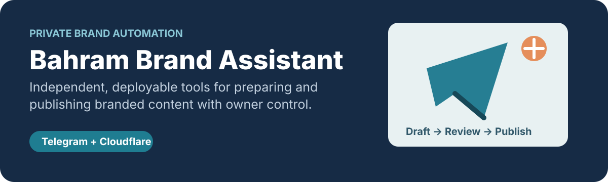

# Bahram Brand Assistant

  

مخزن خصوصیِ پروژه‌های مستقل ابزار و اتوماسیون برند بهرام قربانی. هر پروژه در پوشهٔ خودش نگهداری می‌شود تا وابستگی‌ها، استقرار و مستندات عملیاتی آن با پروژه‌های دیگر تداخل نداشته باشد.

## پروژهٔ فعال

### [Telegram Personal Dastyar](telegram-personal-dastyar/)

ربات بدون‌سرور تلگرام برای تبدیل پیام یا پست فورواردی به پیش‌نویس قابل‌تأیید، پاک‌سازی ارجاعات مبدأ، افزودن امضای قابل‌تنظیم و انتشار تنها پس از تأیید صریح مالک.

- Cloudflare Workers و D1
- پشتیبانی از متن، عکس، ویدئو، صوت، فایل و آلبوم
- حفظ `file_id` تلگرام؛ بدون ذخیره‌سازی جداگانهٔ رسانه
- جلوگیری از پردازش یا انتشار تکراری

برای راه‌اندازی و قرارداد امنیتی، از [README پروژه](telegram-personal-dastyar/README.md)، [راهنمای Codex](telegram-personal-dastyar/docs/CODEX_RUNBOOK_FA.md) و [راهنمای Cloudflare](telegram-personal-dastyar/docs/CLOUDFLARE_RUNBOOK_FA.md) شروع کنید.
